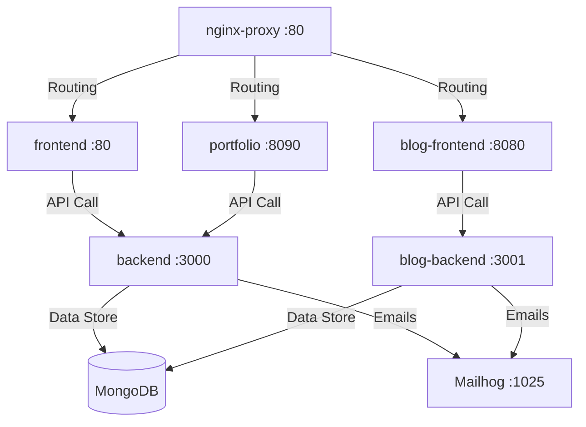

# 🌌 LuminaView 🌌

[](https://github.com/jacnux/luminaview)
[](#)
[](#)
[](#)

> **LuminaView** est un écosystème complet et auto-hébergé conçu sur mesure pour les photographes. Il allie la gestion et l'exposition de galeries d'art en ligne, l'extraction de métadonnées EXIF avancées, un moteur de blog complet (Hélioscope) et un système multi-tenant de portfolios haut de gamme.

---

## 🎨 Les Composants de l'Écosystème

Le projet s'organise autour d'une architecture micro-services orchestrée par Docker Compose :



### 🖥️ 1. Plateforme LuminaView (Core)
*   **[backend](file:///Users/jac/docker/luminaview/blog-luminaview/backend)** : API Node.js/Express en TypeScript. Il extrait automatiquement les métadonnées **EXIF** (modèle d'appareil photo, objectif, ouverture, ISO, temps d'exposition) grâce à `exifr` et gère le redimensionnement fluide des images avec `sharp`.
*   **[frontend](file:///Users/jac/docker/luminaview/blog-luminaview/frontend)** : Interface d'administration en React et Tailwind CSS. Elle permet aux photographes de configurer leur profil, de créer et d'ordonner des pages personnalisées, et de gérer leurs albums.

### 🖼️ 2. Moteur de Portfolio Multi-Tenant
*   **[portfolio](file:///Users/jac/docker/luminaview/blog-luminaview/portfolio)** : Un client léger, rapide et ultra-soigné développé avec React + Vite et servi par Nginx. Il détecte dynamiquement l'utilisateur via le sous-domaine (ex: `jac.helioscope.fr`) pour afficher son portfolio sur-mesure de manière totalement transparente.

### 📝 3. Moteur de Blog (Hélioscope)
*   **[blog-backend](file:///Users/jac/docker/luminaview/blog-luminaview/blog-backend)** : API dédiée au blog, connectée de manière isolée et sécurisée à la même base de données MongoDB.
*   **[blog-frontend](file:///Users/jac/docker/luminaview/blog-luminaview/blog-frontend)** : Interface publique de blog moderne en React permettant la lecture et le partage d'articles rédigés par les photographes.

### 🚦 4. Nginx Reverse Proxy
*   **[nginx](file:///Users/jac/docker/luminaview/blog-luminaview/nginx)** : Point d'entrée unique de l'application qui gère la redirection des noms de domaines et sous-domaines vers les bons conteneurs (Portfolio, Blog, API).

---

## ⚡ Fonctionnalités Clés

*   📸 **Extraction EXIF Automatique** : Affiche les détails techniques de chaque cliché (focale, ouverture, ISO, boîtier, objectif).
*   🚀 **Traitement d'Image Performant** : Optimisation et mise en cache à la volée grâce à Sharp.
*   📂 **Albums Publics & Privés** : Contrôle d'accès fin aux galeries photo.
*   🧭 **Menus Dynamiques Repliables** : Menu de navigation intelligent avec accordéons/dropdowns tactiles et intuitifs (Séries, Expositions).
*   🌐 **Multi-Tenant Natif** : Un seul déploiement de l'application permet de servir des dizaines de portfolios personnalisés sous forme de sous-domaines.
*   📬 **Boîte de Contact & Commentaires** : Les visiteurs peuvent envoyer des messages directs ou commenter les photos pour interagir avec le photographe.

---

## 🔗 Liens de Partage & API Développeurs

LuminaView est conçu pour être ouvert et intégrable très facilement. Il propose deux manières principales de diffuser des galeries en dehors de la plateforme.

### 🔌 1. Intégration d'Albums (Embed Widget)
Les développeurs et blogueurs externes peuvent intégrer n'importe quel album public à l'aide d'une balise `iframe` standard. Le widget s'adapte automatiquement à l'espace disponible et préserve l'interactivité (grille, lightbox responsive) :

```html
<iframe 
  src="https://votre-domaine.fr/embed/album/ID_DE_L_ALBUM" 
  allowfullscreen 
  style="width: 100%; height: 600px; border: 0; border-radius: 12px; overflow: hidden;">
</iframe>
```
*(Un fichier d'exemple et de test est disponible dans la racine du projet : [test-embed.html](file:///Users/jac/docker/luminaview/blog-luminaview/test-embed.html)).*

### 📡 2. API REST Publique & Privée
LuminaView expose des points d'accès (endpoints) HTTP clairs pour interagir avec vos données depuis d'autres applications :

*   **Récupérer les albums et métadonnées d'un portfolio** :
    `GET /api/albums/portfolio/:username`
*   **Lister les photos d'un album spécifique** (avec métadonnées EXIF incluses) :
    `GET /api/albums/photos/:albumId`
*   **Obtenir les pages d'un utilisateur** (Séries, Expositions, etc.) :
    `GET /api/user-pages/:username`
*   **Détail d'une page personnalisée** :
    `GET /api/user-pages/:username/:slug`

---

## 🚀 Démarrage Rapide

### Prérequis
*   **Docker** et **Docker Compose** installés sur votre machine.

### 1. Variables d'environnement
Créez un fichier `.env` à la racine du projet et définissez les configurations requises :

```env
# --- Base de données ---
MONGO_URI=mongodb://mongo:27017/luminaview

# --- API & Sécurité ---
JWT_SECRET=votre_secret_jwt_super_securise
NODE_ENV=production
PUBLIC_URL=https://luminaview.helioscope.fr
REACT_APP_API_URL=https://api.helioscope.fr
MAX_FILE_SIZE_MB=50

# --- Serveur Nginx ---
NGINX_PORT=80

# --- Serveur SMTP ---
SMTP_HOST=mailhog
SMTP_PORT=1025
SMTP_SECURE=false
SMTP_USER=
SMTP_PASS=
SMTP_FROM=noreply@helioscope.fr
```

### 2. Lancement des Services
Pour construire et démarrer l'ensemble des conteneurs en tâche de fond :

```bash
docker compose up -d --build
```

Pour reconstruire spécifiquement le module de Portfolio après modifications :

```bash
docker compose build portfolio
docker compose up -d portfolio
```

---

## 📦 Stack Technique

| Service | Technologies principales |
| :--- | :--- |
| **Backend Core** | `Node.js`, `TypeScript`, `Express`, `Mongoose` (MongoDB), `Sharp`, `Exifr` |
| **Frontend Admin** | `React`, `React Router`, `TailwindCSS`, `Framer Motion` |
| **Portfolio Viewer** | `Vite`, `React`, `Nginx`, `Framer Motion` |
| **Blog Engine** | `Node.js`, `Express`, `React`, `TailwindCSS` |
| **Infrastructure** | `Docker`, `Docker Compose`, `Nginx (Alpine)` |

---

## 🤝 Contribution & Maintenance

Toutes les modifications doivent être versionnées avec des commits clairs et structurés. Pour publier une nouvelle version, suivez les étapes de versionnage avec Git :

1. Commiter les modifications :
   ```bash
   git add .
   git commit -m "feat(module): description des changements en français"
   ```
2. Ajouter le tag de version et pousser :
   ```bash
   git tag vX.Y.Z
   git push origin main --tags
   ```

---
💡 *Propulsé avec amour par le moteur de galeries **LuminaView**.*
